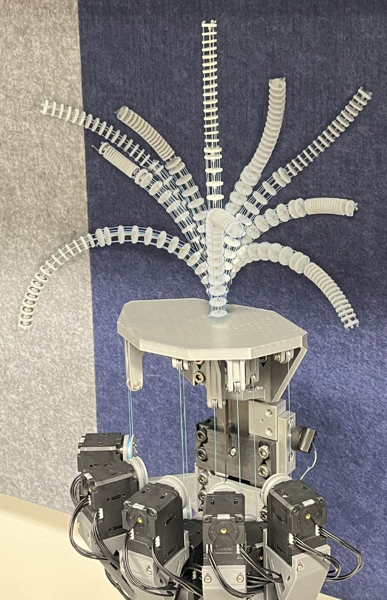
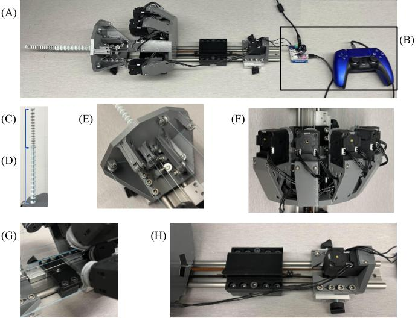

# Extensible Tendon-Driven Continuum Robot
This project includes the design files and link to assembly instructions for a tendon-driven continuum robot with an extensible degree of freedom.

The assembly instructions can be found here: https://docs.google.com/document/d/1z8M8oU-02HvgHBQCzrGDHriGV1tVsbQjVGHuQ0tKlOw/edit?usp=sharing.

## Design Overview

The full robot system consists of the following main components:

- **(A) Entire system** – The fully assembled robot including both segments and the control electronics.  
- **(B) Control components** – Motor driver and controller for teleoperation of TDCR segments.  
- **(C) Extensible or distal segment** – The upper segment capable of both spatial bending (3 tendons) and active extension.  
- **(D) Base or proximal segment** – The lower segment with 5 tendons enabling full spatial bending.  
- **(E) Pulley and manipulator support platform** – Holds base of the manipulator and pulleys for routing tendons from end-effector to motors.  
- **(F) Motor support platform** – Mounts the DYNAMIXEL actuators used for driving the tendons onto the rail.  
- **(G) Driven pulley support platform** – Attaches the driven belt pulley onto the rail.  
- **(H) Driver pulley motor and belt** – The system's belt, along with the attachment fixture used to connect the backbone rod to the belt, and the platform that mounts the driver motor onto the rail.

## Demo

The demonstration is the TDCR navigating two pipe-based task spaces arranged in a planar and three-dimensional configurations. Based on the location and stationary nature of the robot, the extensible degree of freedom is necessary to successfully enter and inspect the pipe.

  
▶️ [Watch the demo](https://youtu.be/u-8E7-xkPwE)
